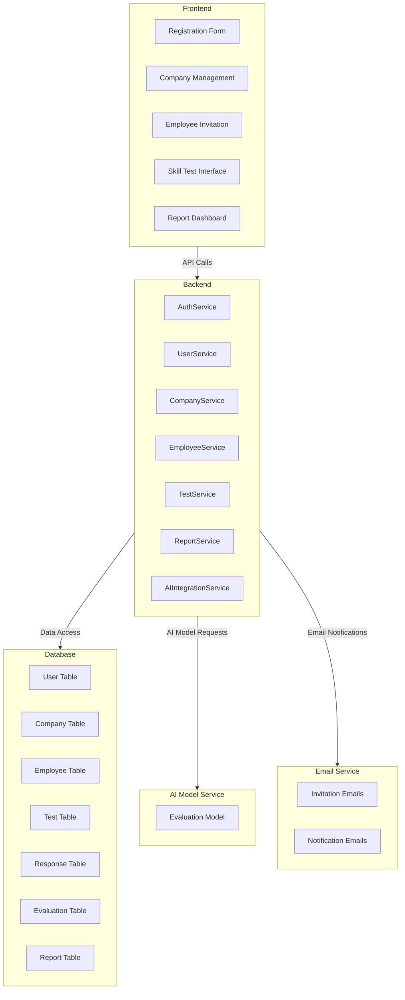

### Component Diagram

## Introduction

The component diagram provides a detailed view of the different software components and their interactions within the AI Assistant system. This diagram helps in understanding the structure of the system at a high level, showing how various components collaborate to achieve the system's functionalities.

## Component Diagram

### Diagram

### Components

#### Frontend

- **Registration Form:** Interface for new users to register and create a company profile.
- **Company Management:** Interface for managers to update company settings and manage billing information.
- **Employee Invitation:** Interface for managers to invite employees to join the company.
- **Skill Test Interface:** Interface for employees to take skill tests.
- **Report Dashboard:** Interface for managers to view and analyze reports.

#### Backend

- **AuthService:** Handles authentication and user registration.
- **UserService:** Manages user data and roles.
- **CompanyService:** Manages company profiles and settings.
- **EmployeeService:** Manages employee data and invitations.
- **TestService:** Administers skill tests and collects responses.
- **ReportService:** Generates and provides access to reports.
- **AIIntegrationService:** Interacts with the AI model to evaluate test responses.

#### Database

- **User Table:** Stores user information and credentials.
- **Company Table:** Stores company profiles and settings.
- **Employee Table:** Stores employee information and their association with companies.
- **Test Table:** Stores skill test information.
- **Response Table:** Stores responses from skill tests.
- **Evaluation Table:** Stores evaluation results from the AI model.
- **Report Table:** Stores generated reports for managers.

#### AI Model Service

- **Evaluation Model:** AI model used to evaluate test responses and generate results.

#### Email Service

- **Invitation Emails:** Sends invitation emails to employees.
- **Notification Emails:** Sends notification emails for various events.

## Conclusion

The component diagram provides a clear overview of the structure and interactions within the AI Assistant system. By understanding these components and their relationships, developers can effectively design, maintain, and extend the system. This diagram serves as a foundational reference for understanding how the system's parts work together to deliver its functionalities.