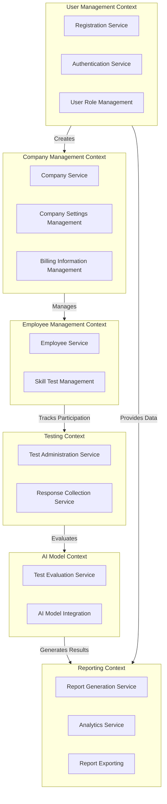

### Context Map

## Introduction

The context map provides an overview of the interactions and boundaries between various parts of the AI Assistant system, including the company and employee schema. It highlights the key contexts, their relationships, and how they communicate with each other. This document serves as a guide to understand the overall structure and interactions within the system.

## Bounded Contexts

### 1. User Management Context

- **Responsibilities:**
  - Handle user registration and authentication.
  - Manage user roles and permissions.
  - Facilitate user invitations.

- **Key Components:**
  - Registration Service
  - Authentication Service
  - User Role Management

### 2. Company Management Context

- **Responsibilities:**
  - Manage company profiles and settings.
  - Handle company-specific data such as logo, description, industry, and billing information.
  - Associate users with companies and manage their roles.
  - Enable managers to invite employees.

- **Key Components:**
  - Company Service
  - Company Settings Management
  - Billing Information Management

### 3. Employee Management Context

- **Responsibilities:**
  - Manage employee profiles within the company.
  - Track employee participation in skill tests.
  - Provide access to employee-specific data for reporting.

- **Key Components:**
  - Employee Service
  - Skill Test Management

### 4. Testing Context

- **Responsibilities:**
  - Administer skill tests to employees.
  - Collect and store test responses.
  - Interact with the AI Model to evaluate test responses and generate results.

- **Key Components:**
  - Test Administration Service
  - Response Collection Service

### 5. AI Model Context

- **Responsibilities:**
  - Evaluate test responses using AI algorithms.
  - Generate skill evaluation results based on test responses.

- **Key Components:**
  - Test Evaluation Service
  - AI Model Integration

### 6. Reporting Context

- **Responsibilities:**
  - Generate and display reports based on user interactions and test results.
  - Provide analytics and insights for managers.
  - Allow export of reports for offline use.

- **Key Components:**
  - Report Generation Service
  - Analytics Service
  - Report Exporting

## Interactions and Relationships

### User Management and Company Management

- **Relationship:**
  - The User Management context is responsible for creating and managing users. When a new user registers, they can create a new company profile within the Company Management context.
  - The User Management context assigns roles to users within the company, such as Manager or Employee.

- **Communication:**
  - The Registration Service communicates with the Company Service to create a new company profile during user registration.
  - The User Role Management component updates user roles and associations with the company.

### User Management and Employee Management

- **Relationship:**
  - The Employee Management context manages employees within a company. The User Management context handles the invitation and onboarding of new employees.
  - Employees take skill tests and their results are tracked within this context.

- **Communication:**
  - The User Management context uses the Employee Service to invite and register employees.
  - The Skill Test Management component tracks employee participation and results.

### Company Management and Employee Management

- **Relationship:**
  - The Company Management context interacts with the Employee Management context to manage employees' roles and track their activities.
  - The manager can view and update employee details and monitor their test results.

- **Communication:**
  - The Company Service communicates with the Employee Service to manage employees and their roles.
  - The Company Settings Management component ensures that company-related information is correctly associated with employees.

### Employee Management and Testing

- **Relationship:**
  - The Testing context administers skill tests to employees and collects their responses.
  - The Employee Management context tracks which employees have taken tests and stores their responses.

- **Communication:**
  - The Skill Test Management component communicates with the Test Administration Service to schedule and administer tests.
  - The Response Collection Service gathers test responses and links them to the appropriate employee profiles.

### Testing and AI Model

- **Relationship:**
  - The Testing context interacts with the AI Model context to evaluate test responses.
  - The AI Model context processes the test responses and generates skill evaluation results.

- **Communication:**
  - The Test Administration Service sends collected test responses to the Test Evaluation Service.
  - The AI Model Integration component processes the responses and returns the evaluation results.

### AI Model and Reporting

- **Relationship:**
  - The Reporting context uses the results generated by the AI Model context to create reports and analytics.
  - The AI Model provides detailed skill evaluations that feed into the reporting system.

- **Communication:**
  - The Report Generation Service retrieves evaluation results from the AI Model context.
  - The Analytics Service uses these results to create comprehensive reports.

## Communication Patterns

### Synchronous Communication

- **API Calls:**
  - The frontend makes synchronous API calls to the backend services within the User Management, Company Management, Employee Management, Testing, and Reporting contexts.
  - Examples include user registration, updating company settings, inviting employees, taking tests, and fetching reports.

### Asynchronous Communication

- **Events:**
  - Certain actions, such as user registration or company creation, may trigger events that are processed asynchronously to update reports or analytics.
  - This ensures that the system remains responsive and can handle large volumes of data efficiently.

## Diagram

Below is a visual representation of the context map:

## Conclusion

The context map provides a clear overview of the boundaries and interactions between the different parts of the AI Assistant system, including the new company and employee schema, skill tests, and AI evaluation. By understanding these contexts and their relationships, developers can ensure a cohesive and well-integrated system that meets the needs of users, managers, and companies alike.