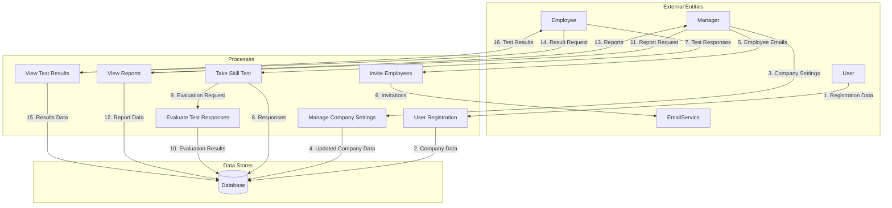
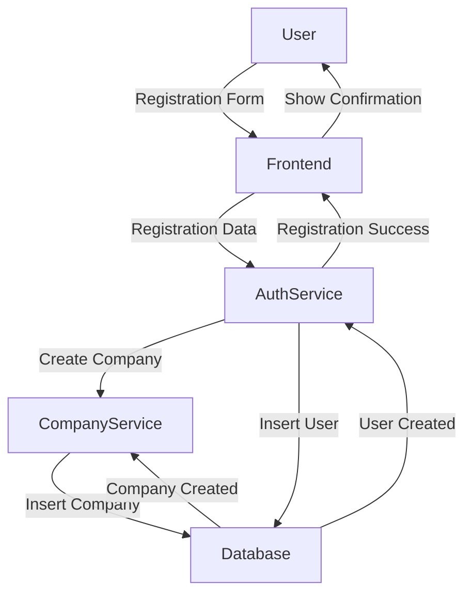
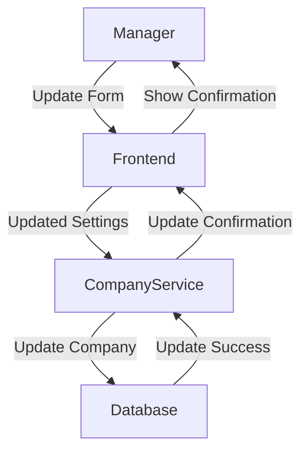
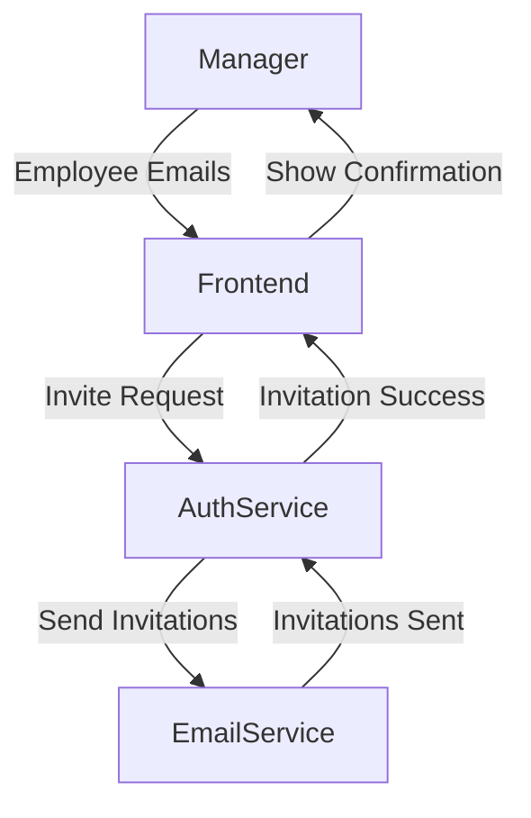
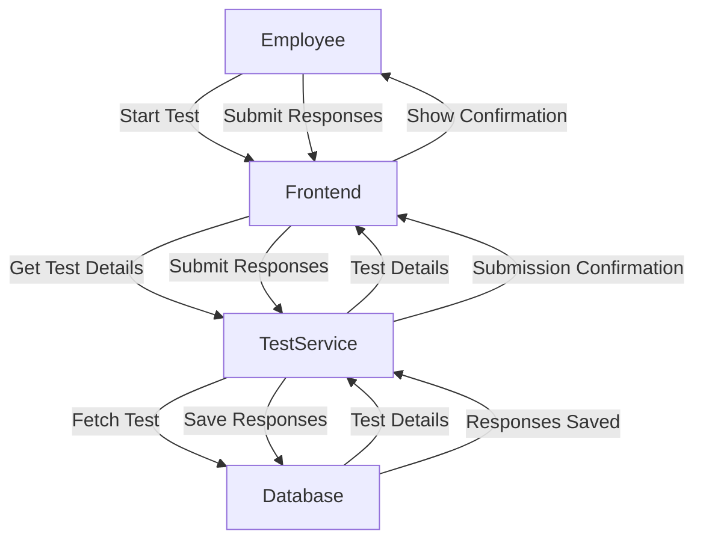
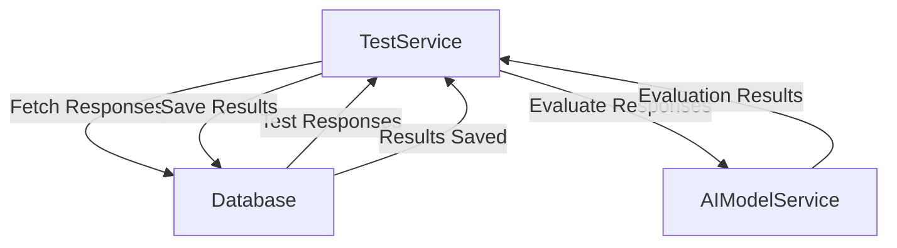
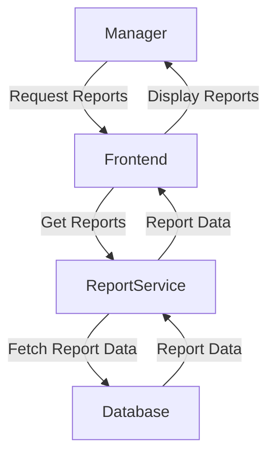
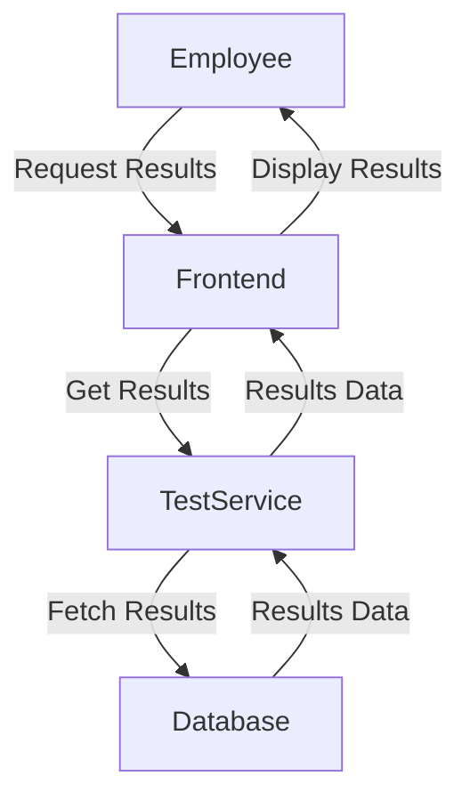

### Data Flow Diagram

## Introduction

The data flow diagram (DFD) provides a visual representation of the flow of data within the AI Assistant system. It illustrates how data moves between different components, highlighting the processes, data stores, and external entities involved. This document describes the DFD for key processes within the system, offering a clear picture of the system’s data dynamics.

## Data Flow Diagram

### Level 0: Context Diagram

The Level 0 DFD provides an overview of the entire system, showing the major processes and the flow of data between them.

### Level 1: Detailed Diagrams

#### 1. User Registration

**Description:** This process involves a user registering and creating a company profile.

#### 2. Manage Company Settings

**Description:** This process involves a manager updating the company settings.

#### 3. Invite Employees

**Description:** This process involves a manager inviting employees to the company.

#### 4. Take Skill Test

**Description:** This process involves an employee taking a skill test.

#### 5. Evaluate Test Responses

**Description:** This process involves evaluating the skill test responses using the AI model.

#### 6. View Reports

**Description:** This process involves a manager viewing detailed reports.

#### 7. View Test Results

**Description:** This process involves an employee viewing their test results.

## Conclusion

The data flow diagrams provide a clear visual representation of the data movement within the AI Assistant system. By understanding these flows, developers can ensure that data is handled efficiently and securely across different components of the system. This detailed mapping helps in designing, maintaining, and troubleshooting the system effectively.