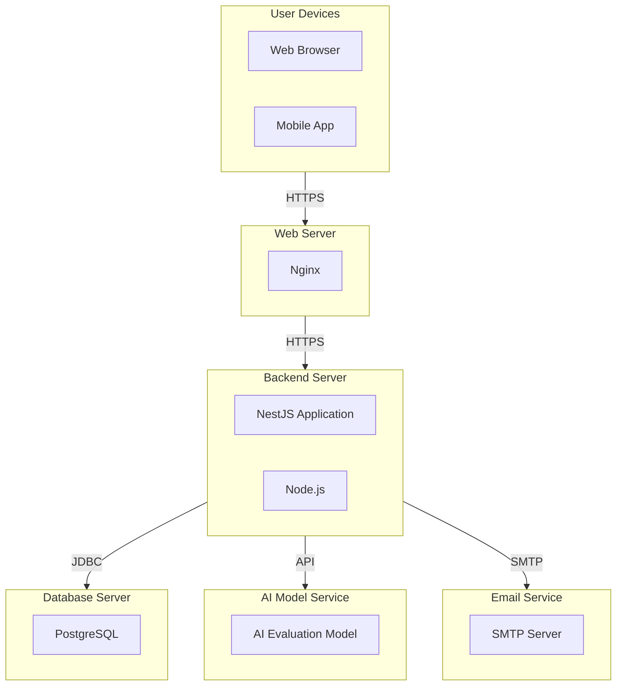

### Deployment Diagram

## Introduction

The deployment diagram provides a visual representation of the physical deployment of the AI Assistant system. It illustrates how different software components are deployed on various infrastructure nodes. This diagram helps in understanding the deployment architecture and the relationships between different hardware and software elements.

## Deployment Diagram

### Diagram

### Nodes

#### User Devices

- **Web Browser:** Used by managers and employees to interact with the AI Assistant system.
- **Mobile App:** Optional, for accessing the system on mobile devices.

#### Web Server

- **Nginx:** Acts as a reverse proxy to forward requests to the backend server.

#### Backend Server

- **NestJS Application:** The main application server running the backend services.
- **Node.js:** Runtime environment for executing the backend application.

#### Database Server

- **PostgreSQL:** Relational database server for storing user, company, test, response, evaluation, and report data.

#### AI Model Service

- **AI Evaluation Model:** Service that hosts the AI model used for evaluating test responses.

#### Email Service

- **SMTP Server:** Server responsible for sending invitation and notification emails.

## Deployment Flow

1. **User Interaction:**
   - Users (managers and employees) interact with the AI Assistant system through web browsers or mobile apps.

2. **Request Handling:**
   - Requests from user devices are sent over HTTPS to the Nginx web server.
   - Nginx forwards these requests to the NestJS application running on the backend server.

3. **Backend Processing:**
   - The NestJS application processes the requests and interacts with the PostgreSQL database for data storage and retrieval.
   - For skill test evaluations, the backend communicates with the AI Model Service via an API.
   - The backend also sends emails through the SMTP server as needed.

4. **Data Storage:**
   - The PostgreSQL database stores all relevant data, including user information, company details, test responses, evaluations, and reports.

5. **AI Evaluation:**
   - The AI Model Service evaluates skill test responses and returns the results to the backend for further processing and storage.

## Conclusion

The deployment diagram provides a comprehensive view of how the AI Assistant system is physically deployed across different infrastructure components. Understanding this deployment architecture helps in planning, scaling, and maintaining the system effectively. This diagram serves as a crucial reference for system administrators and developers involved in the deployment and operation of the AI Assistant system.