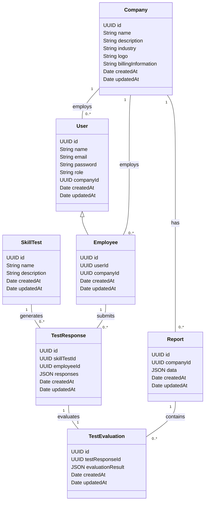

### Domain Diagram

## Introduction

The domain diagram provides a detailed view of the key entities and their relationships within the AI Assistant system. This document highlights the primary domains involved, such as user management, company management, employee management, testing, AI model evaluation, and reporting. Understanding these domains and their interactions is crucial for building a cohesive and well-integrated system.

## Key Domains and Entities

### 1. User Domain

**Entities:**
- **User**
  - **Attributes:**
    - id (UUID)
    - name (String)
    - email (String)
    - password (String)
    - role (String: 'manager' or 'employee')
    - companyId (UUID)
    - createdAt (Date)
    - updatedAt (Date)

**Relationships:**
- A User can belong to one Company.
- A User can have multiple roles such as 'manager' or 'employee'.

### 2. Company Domain

**Entities:**
- **Company**
  - **Attributes:**
    - id (UUID)
    - name (String)
    - description (String)
    - industry (String)
    - logo (String)
    - billingInformation (String)
    - createdAt (Date)
    - updatedAt (Date)

**Relationships:**
- A Company can have multiple Users.
- A Company is managed by one or more Users with the 'manager' role.

### 3. Employee Domain

**Entities:**
- **Employee**
  - **Attributes:**
    - id (UUID)
    - userId (UUID)
    - companyId (UUID)
    - createdAt (Date)
    - updatedAt (Date)

**Relationships:**
- An Employee is a type of User associated with a Company.
- An Employee can take multiple Skill Tests.

### 4. Testing Domain

**Entities:**
- **SkillTest**
  - **Attributes:**
    - id (UUID)
    - name (String)
    - description (String)
    - createdAt (Date)
    - updatedAt (Date)

- **TestResponse**
  - **Attributes:**
    - id (UUID)
    - skillTestId (UUID)
    - employeeId (UUID)
    - responses (JSON)
    - createdAt (Date)
    - updatedAt (Date)

**Relationships:**
- A SkillTest can be taken by multiple Employees.
- A TestResponse is associated with one SkillTest and one Employee.

### 5. AI Model Domain

**Entities:**
- **TestEvaluation**
  - **Attributes:**
    - id (UUID)
    - testResponseId (UUID)
    - evaluationResult (JSON)
    - createdAt (Date)
    - updatedAt (Date)

**Relationships:**
- A TestEvaluation is generated from one TestResponse.

### 6. Reporting Domain

**Entities:**
- **Report**
  - **Attributes:**
    - id (UUID)
    - companyId (UUID)
    - data (JSON)
    - createdAt (Date)
    - updatedAt (Date)

**Relationships:**
- A Report is generated for one Company and can include data from multiple TestEvaluations.

## Domain Diagram

Below is a visual representation of the domain model:

## Conclusion

This domain diagram provides a detailed view of the key entities and their relationships within the AI Assistant system. By understanding these domains and their interactions, developers can ensure a cohesive and well-integrated system that meets the needs of users, managers, and companies alike. This detailed mapping helps in designing and maintaining the system effectively.