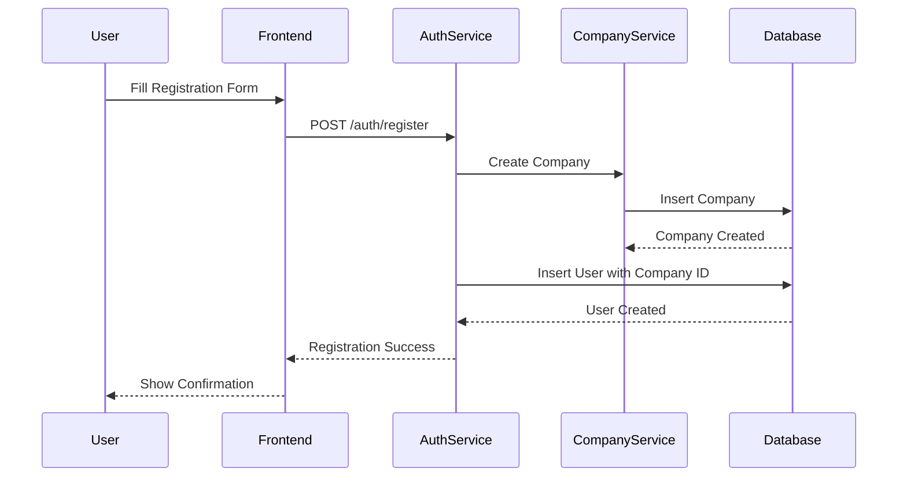
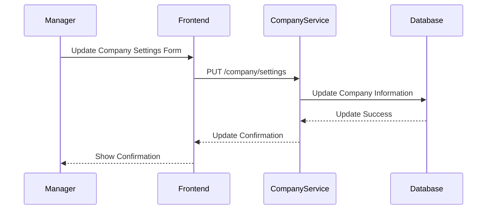
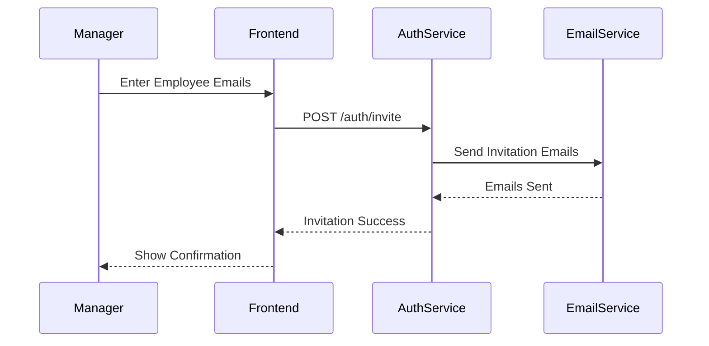
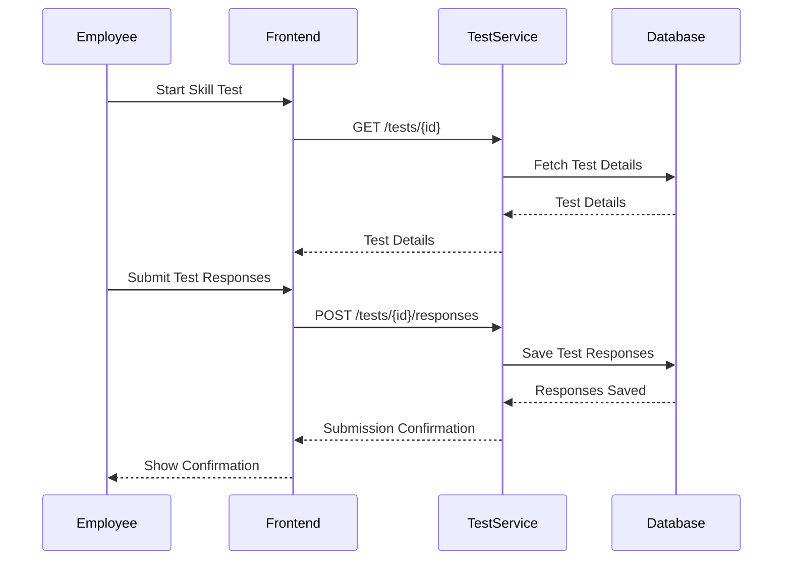
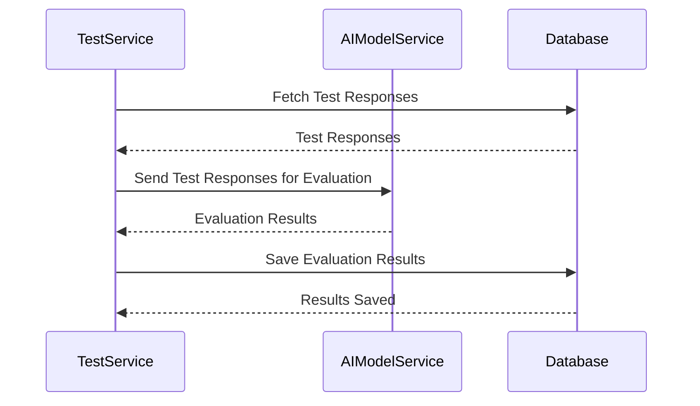
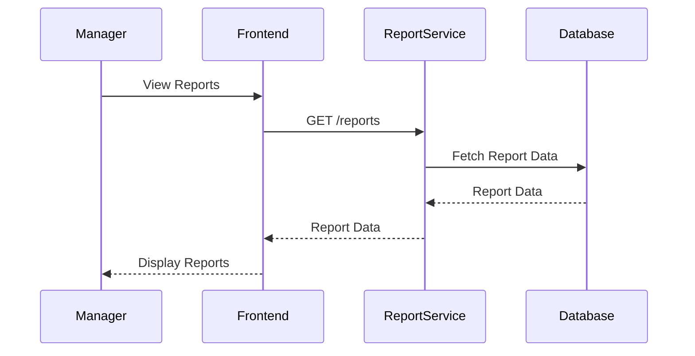
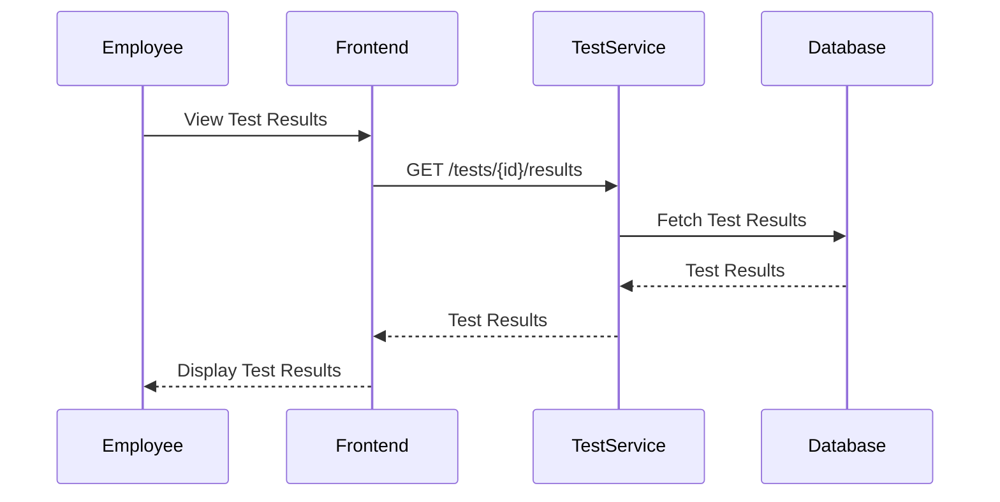

### Sequence Diagrams

## Introduction

Sequence diagrams provide a detailed view of the interactions between various components of the AI Assistant system over time. They illustrate how different parts of the system collaborate to achieve specific functionalities. This document describes the sequence diagrams for key use cases, providing insight into the dynamic behavior of the system.

## Sequence Diagrams

### 1. User Registration

**Description:** This sequence diagram shows the steps involved in the user registration process, where a new user registers and creates a company profile, becoming a manager.

### 2. Manage Company Settings

**Description:** This sequence diagram shows how a manager updates the company settings such as logo, description, industry, and billing details.

### 3. Invite Employees

**Description:** This sequence diagram illustrates how a manager invites employees to join the company.

### 4. Take Skill Test

**Description:** This sequence diagram details the process of an employee taking a skill test.

### 5. Evaluate Test Responses

**Description:** This sequence diagram shows how the AI model evaluates the test responses and generates results.

### 6. View Reports

**Description:** This sequence diagram shows how a manager views detailed reports based on employee test results.

### 7. View Test Results

**Description:** This sequence diagram illustrates how an employee views their own test results.

## Conclusion

The sequence diagrams provide a detailed view of the interactions between different components of the AI Assistant system for key use cases. These diagrams help in understanding the dynamic behavior of the system, ensuring that the interactions between various parts are well-defined and coordinated. By following these sequences, developers can ensure that the system's functionalities are implemented correctly and efficiently.