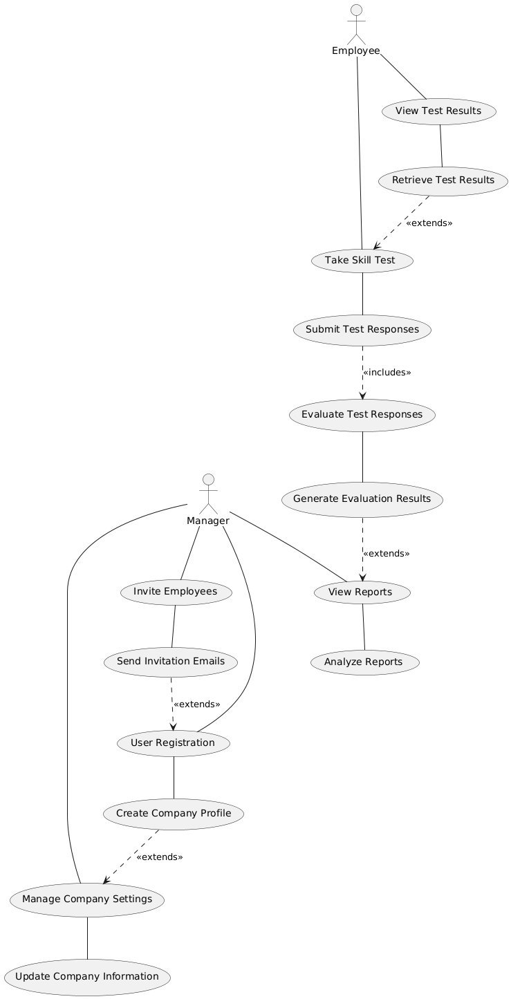

### Use Case Diagram

## Introduction

The use case diagram provides a high-level overview of the functionalities of the AI Assistant system by illustrating the interactions between users (actors) and the system (use cases). This document describes the primary use cases, actors, and their relationships, giving a clear picture of the system's capabilities and how users interact with it.

## Actors

### 1. Manager

- **Description:** A user with the role of a manager who can create and manage a company, invite employees, and view reports.
- **Responsibilities:**
  - Register and create a company.
  - Manage company settings and billing information.
  - Invite employees to take skill tests.
  - View and analyze reports.

### 2. Employee

- **Description:** A user who is invited by a manager to take skill tests and view their results.
- **Responsibilities:**
  - Register and join a company.
  - Take skill tests.
  - View personal test results.

## Use Cases

### 1. User Registration

- **Description:** Allows a user to register, create a company, and become a manager.
- **Actors:** Manager
- **Steps:**
  1. The manager fills out the registration form with personal and company details.
  2. The system validates the input and creates a new user and company profile.
  3. The manager receives a confirmation and logs in.

### 2. Manage Company Settings

- **Description:** Allows the manager to update company information, such as logo, description, industry, and billing details.
- **Actors:** Manager
- **Steps:**
  1. The manager navigates to the company settings page.
  2. The manager updates the company information.
  3. The system saves the changes and updates the company profile.

### 3. Invite Employees

- **Description:** Allows the manager to invite employees to join the company and take skill tests.
- **Actors:** Manager
- **Steps:**
  1. The manager enters the email addresses of the employees to invite.
  2. The system sends invitation emails to the employees.
  3. The employees receive the invitations and register.

### 4. Take Skill Test

- **Description:** Allows employees to take assigned skill tests.
- **Actors:** Employee
- **Steps:**
  1. The employee logs in and navigates to the skill test page.
  2. The employee completes the skill test.
  3. The system stores the test responses.

### 5. Evaluate Test Responses

- **Description:** The system evaluates the skill test responses using the AI model and generates results.
- **Actors:** System (AI Model)
- **Steps:**
  1. The system collects test responses.
  2. The AI model evaluates the responses.
  3. The system generates and stores the evaluation results.

### 6. View Reports

- **Description:** Allows the manager to view detailed reports and analytics based on employee test results.
- **Actors:** Manager
- **Steps:**
  1. The manager logs in and navigates to the reports page.
  2. The system retrieves and displays the reports.
  3. The manager analyzes the reports and exports them if needed.

### 7. View Test Results

- **Description:** Allows employees to view their own test results.
- **Actors:** Employee
- **Steps:**
  1. The employee logs in and navigates to the test results page.
  2. The system retrieves and displays the test results.

## Diagram

Below is a visual representation of the use case diagram:
<table>
<tbody>
<tr>
<td>
    usecaseDiagram
    actor Manager as M
    actor Employee as E
    
    M -- (User Registration)
    M -- (Manage Company Settings)
    M -- (Invite Employees)
    M -- (View Reports)
    
    E -- (Take Skill Test)
    E -- (View Test Results)
    
    (User Registration) -- (Create Company Profile)
    (Manage Company Settings) -- (Update Company Information)
    (Invite Employees) -- (Send Invitation Emails)
    (Take Skill Test) -- (Submit Test Responses)
    (Evaluate Test Responses) -- (Generate Evaluation Results)
    (View Reports) -- (Analyze Reports)
    (View Test Results) -- (Retrieve Test Results)
    
    (Submit Test Responses) ..> (Evaluate Test Responses) : <<includes>>
    (Create Company Profile) ..> (Manage Company Settings) : <<extends>>
    (Send Invitation Emails) ..> (User Registration) : <<extends>>
    (Generate Evaluation Results) ..> (View Reports) : <<extends>>
    (Retrieve Test Results) ..> (Take Skill Test) : <<extends>>

</td>
<td>

</td>
</tr>

</tbody>
</table>

## Use Case Descriptions

### User Registration

**Description:**
Allows a user to register, create a company, and become a manager.

**Actors:**
Manager

**Steps:**
1. The manager fills out the registration form with personal and company details.
2. The system validates the input and creates a new user and company profile.
3. The manager receives a confirmation and logs in.

### Manage Company Settings

**Description:**
Allows the manager to update company information, such as logo, description, industry, and billing details.

**Actors:**
Manager

**Steps:**
1. The manager navigates to the company settings page.
2. The manager updates the company information.
3. The system saves the changes and updates the company profile.

### Invite Employees

**Description:**
Allows the manager to invite employees to join the company and take skill tests.

**Actors:**
Manager

**Steps:**
1. The manager enters the email addresses of the employees to invite.
2. The system sends invitation emails to the employees.
3. The employees receive the invitations and register.

### Take Skill Test

**Description:**
Allows employees to take assigned skill tests.

**Actors:**
Employee

**Steps:**
1. The employee logs in and navigates to the skill test page.
2. The employee completes the skill test.
3. The system stores the test responses.

### Evaluate Test Responses

**Description:**
The system evaluates the skill test responses using the AI model and generates results.

**Actors:**
System (AI Model)

**Steps:**
1. The system collects test responses.
2. The AI model evaluates the responses.
3. The system generates and stores the evaluation results.

### View Reports

**Description:**
Allows the manager to view detailed reports and analytics based on employee test results.

**Actors:**
Manager

**Steps:**
1. The manager logs in and navigates to the reports page.
2. The system retrieves and displays the reports.
3. The manager analyzes the reports and exports them if needed.

### View Test Results

**Description:**
Allows employees to view their own test results.

**Actors:**
Employee

**Steps:**
1. The employee logs in and navigates to the test results page.
2. The system retrieves and displays the test results.

## Conclusion

This use case diagram and descriptions provide a clear understanding of the functionalities of the AI Assistant system and how different actors interact with it. By detailing the use cases, actors, and their relationships, developers can ensure that the system meets the needs of its users and provides a seamless experience for both managers and employees.